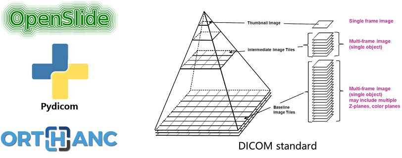
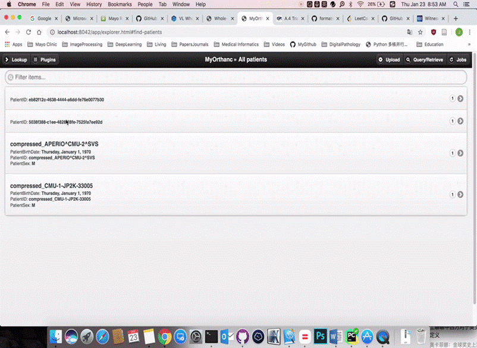

####Cite our work:
```
Gu, Qiangqiang, Naresh Prodduturi, Jun Jiang, Thomas J. Flotte, and Steven N. Hart. "Dicom_wsi: A python implementation for converting whole-slide images to digital imaging and Communications in Medicine compliant files." Journal of Pathology Informatics 12, no. 1 (2021): 21.
```

This repo shows how to convert whole slide image into multi-frame DICOM images. It depends on [Openslides](https://openslide.org/) and [Pydicom](https://pydicom.github.io/)

### Motivation
* Standardize WSI formatting and transferring throughout institutions. 
* Enable more encapsulation options for massive data storage
* Potentially simplify patch/frame level accessibility

Here is an example showing the converted DICOM can be viewed in a DICOM viewer [Orthanc](https://www.orthanc-server.com). 


### Dependencies Installation
```
pip install pydicom openslide_python
```
> You may also need to [install OpenSlide library](https://gist.github.com/digvijayky/b01c3f5e05ea0619c26d1bcc323c3761) other than python interface.

### Quick Start
Code is super easy to use. Test data can be downloaded from [here](http://openslide.cs.cmu.edu/download/openslide-testdata/Aperio/).

``` python
wsi_fn = '/path/to/your/WSI/example/CMU-1-JP2K-33005.svs'
wsi_dicom_dir = "/path/to/your/output/example/CMU-1-JP2K-33005"

# # convert without compression
# p = parameters(JPEG_COMPRESS=False, image_levels=range(0, 3))
# wsi_c = WSIDICOM_Converter(wsi_fn, wsi_dicom_dir, p)
# wsi_c.convert()

# convert with compression
p = parameters(JPEG_COMPRESS=True)
wsi_c = WSIDICOM_Converter(wsi_fn, wsi_dicom_dir, p)
wsi_c.convert()
```

### References
[1] Clunie, David, Dan Hosseinzadeh, Mikael Wintell, David De Mena, Nieves Lajara, Marcial Garcia-Rojo, Gloria Bueno et al. "Digital imaging and communications in medicine whole slide imaging connectathon at digital pathology association pathology visions 2017." Journal of pathology informatics 9 (2018).

[2] http://dicom.nema.org/Dicom/DICOMWSI/

[3] ftp://medical.nema.org/medical/dicom/final/sup145_ft.pdf


